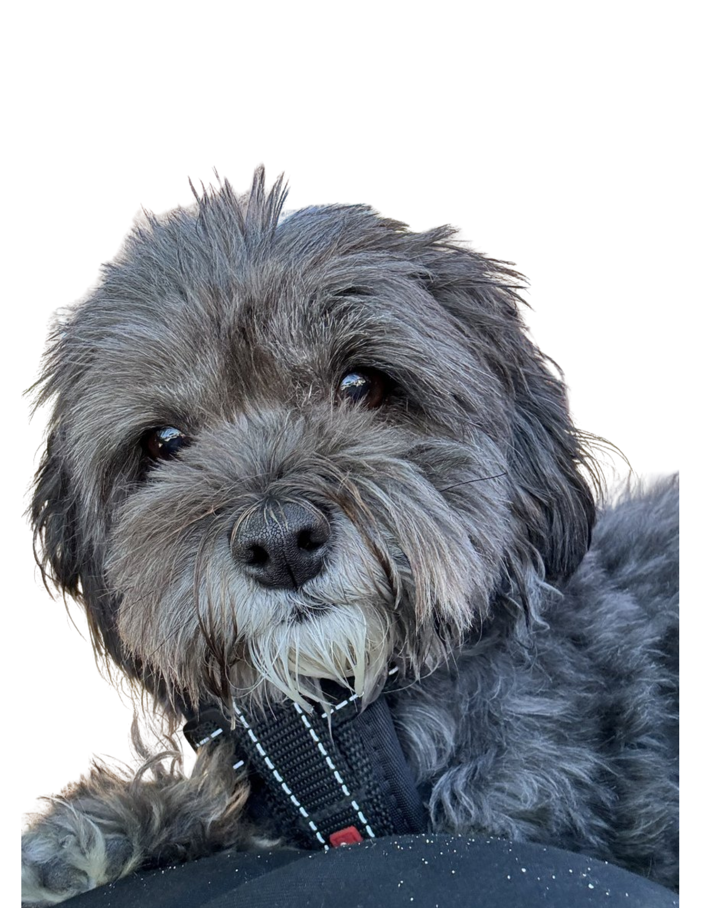
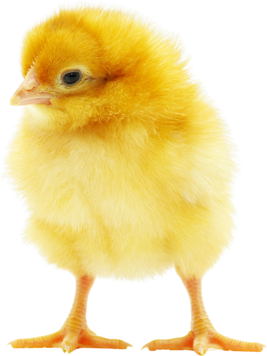
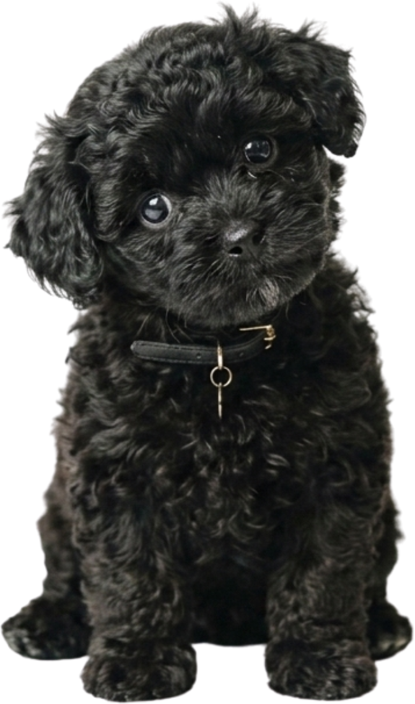
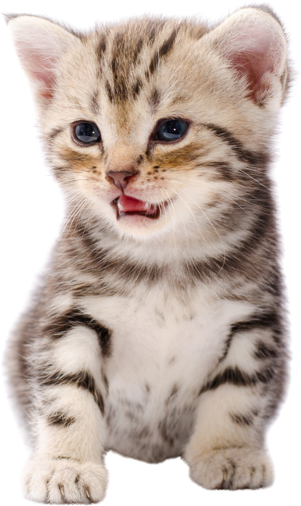
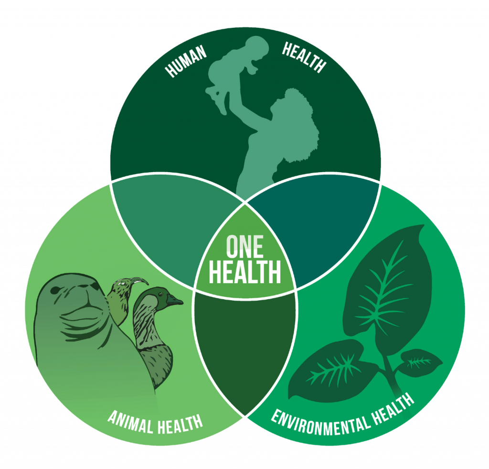

<!DOCTYPE html>
<html>
<head>
<meta charset="utf-8">
<meta name="viewport" content="width=device-width, initial-scale=1">

</head>
<body><template id="__bundler_thumbnail"><svg xmlns="http://www.w3.org/2000/svg" viewBox="0 0 200 200"><rect width="200" height="200" fill="#152B2E"/><circle cx="100" cy="100" r="52" fill="#C08D97"/><g fill="#C4315C"><circle cx="86" cy="86" r="5"/><circle cx="108" cy="94" r="5"/><circle cx="92" cy="112" r="5"/><circle cx="114" cy="118" r="5"/><circle cx="100" cy="72" r="4"/></g><text x="100" y="168" font-family="Georgia,serif" font-size="26" fill="#EBF2F1" text-anchor="middle">GS</text></svg></template>
<x-dc>
<helmet>
<meta name="description" content="Génesis Lucía Soto Sepúlveda, Médica Veterinaria y doctoranda en Ciencias Silvoagropecuarias y Veterinarias, Universidad de Chile. Investigación en resistencia antimicrobiana bajo el enfoque One Health.">
<link rel="preconnect" href="https://fonts.googleapis.com">
<link rel="preconnect" href="https://fonts.gstatic.com" crossorigin>
<link href="https://fonts.googleapis.com/css2?family=Cormorant+Garamond:ital,wght@0,500;0,600;1,500&family=DM+Sans:opsz,wght@9..40,400;9..40,500&family=JetBrains+Mono:wght@400;500&display=swap" rel="stylesheet">

</helmet>

  <header style="position:sticky;top:0;z-index:20;background:rgba(235,242,241,0.93);backdrop-filter:blur(8px);border-bottom:1px solid #D6E4E1;">
    

      

        Génesis Soto Sepúlveda
        One Health · AMR
      

      

        <nav style="display:flex;gap:24px;flex-wrap:wrap;">
          <a href="#inspiracion" data-i18n="nav-inspiracion" style="text-decoration:none;color:#4F6266;font-size:14px;" style-hover="color:#152B2E;">Inspiración</a>
          <a href="#investigacion" data-i18n="nav-investigacion" style="text-decoration:none;color:#4F6266;font-size:14px;" style-hover="color:#152B2E;">Investigación</a>
          <a href="#especies" data-i18n="nav-especies" style="text-decoration:none;color:#4F6266;font-size:14px;" style-hover="color:#152B2E;">Especies</a>
          <a href="#contribucion" data-i18n="nav-contribucion" style="text-decoration:none;color:#4F6266;font-size:14px;" style-hover="color:#152B2E;">Contribución</a>
          <a href="#contacto" data-i18n="nav-contacto" style="text-decoration:none;color:#4F6266;font-size:14px;" style-hover="color:#152B2E;">Contacto</a>
        </nav>
        <button type="button" onClick="{{ toggleLang }}" data-lang-btn aria-label="Switch language / Cambiar idioma" style="border:1px solid #CBDCD8;background:transparent;color:#4F6266;font-family:'JetBrains Mono',monospace;font-size:11px;letter-spacing:0.12em;padding:6px 13px;border-radius:2px;cursor:pointer;" style-hover="border-color:#2C6E74;color:#2C6E74;">EN</button>
      

    

  </header>

  

    

      
One Health · Resistencia antimicrobiana

      <h1 style="font-family:'Cormorant Garamond',Georgia,serif;font-weight:500;font-size:68px;line-height:1.02;letter-spacing:-0.015em;margin:0 0 24px;color:#152B2E;">Génesis Lucía Soto Sepúlveda</h1>
      

      
Médica Veterinaria · Estudiante de Doctorado en Ciencias Silvoagropecuarias y Veterinarias, Universidad de Chile. Investigo la circulación de <em style="font-style:italic;">Escherichia coli</em> resistente entre animales de compañía, aves de producción y el ambiente.

      

        <a href="#contacto" data-i18n="btn-primary" style="display:inline-block;padding:12px 26px;background:#152B2E;color:#EBF2F1;text-decoration:none;font-size:14.5px;border:1px solid #152B2E;border-radius:2px;transition:background .2s ease,border-color .2s ease;" style-hover="background:#2C6E74;border-color:#2C6E74;">Escríbeme</a>
        <a href="#investigacion" data-i18n="btn-ghost" style="display:inline-block;padding:12px 26px;background:transparent;color:#152B2E;text-decoration:none;font-size:14.5px;border:1px solid #BFD5D1;border-radius:2px;transition:border-color .2s ease,color .2s ease;" style-hover="border-color:#2C6E74;color:#2C6E74;">Ver investigación</a>
      

    

    <figure style="margin:0;background:#FFFFFF;border:1px solid #D6E4E1;border-radius:3px;padding:24px 24px 20px;box-shadow:0 20px 44px rgba(20,32,43,0.06);">
      <svg data-mck viewBox="14 14 372 396" role="img" aria-label="Animación de un urocultivo en agar MacConkey con estriado de Kass: el asa calibrada deposita la orina en una línea central y luego recorre la placa con un estriado continuo en curvas que cruza esa línea; después aparecen las colonias rosadas de Escherichia coli, fermentadora de lactosa." style="display:block;width:86%;margin:0 auto;height:auto;">
  <defs>
    <radialGradient id="mckAgar" cx="40%" cy="34%" r="74%">
      <stop offset="0%" stop-color="#D3A7AF"></stop>
      <stop offset="70%" stop-color="#C08D97"></stop>
      <stop offset="100%" stop-color="#AC7A85"></stop>
    </radialGradient>
    <radialGradient id="mckBile" cx="50%" cy="50%" r="50%">
      <stop offset="0%" stop-color="#C33A62" stop-opacity="0.34"></stop>
      <stop offset="100%" stop-color="#C33A62" stop-opacity="0"></stop>
    </radialGradient>
    <radialGradient id="mckGlass" cx="30%" cy="20%" r="62%">
      <stop offset="0%" stop-color="#FFFFFF" stop-opacity="0.32"></stop>
      <stop offset="62%" stop-color="#FFFFFF" stop-opacity="0"></stop>
    </radialGradient>
  </defs>
  <circle cx="200" cy="200" r="180" fill="none" stroke="#DCEAE7" stroke-width="7"></circle>
  <circle cx="200" cy="200" r="174" fill="url(#mckAgar)"></circle>
  <g fill="url(#mckBile)" style="animation:mck-colony 14s ease infinite both;animation-delay:.5s;">
    <ellipse cx="200" cy="200" rx="46" ry="150"></ellipse>
  </g>
  <g fill="none" stroke="#9C6875" stroke-width="3.4" stroke-linecap="round" opacity="0.42"><path d="M200 44 L200 356" pathLength="100" stroke-dasharray="100" style="animation:mck-streak 14s cubic-bezier(.3,0,.3,1) infinite both;animation-delay:.15s;"></path><path d="M122.0 66.0 C168.8 61.0 231.2 71.0 278.0 66.0 C293.0 66.0 293.0 83.5 278.0 83.5 C239.3 78.5 160.7 88.5 101.7 83.5 C86.7 83.5 86.7 101.0 101.7 101.0 C154.7 96.0 245.3 106.0 313.2 101.0 C328.2 101.0 328.2 118.5 313.2 118.5 C249.8 113.5 150.2 123.5 75.4 118.5 C60.4 118.5 60.4 136.0 75.4 136.0 C146.7 131.0 253.3 141.0 333.2 136.0 C348.2 136.0 348.2 153.5 333.2 153.5 C255.7 148.5 144.3 158.5 60.6 153.5 C45.6 153.5 45.6 171.0 60.6 171.0 C142.6 166.0 257.4 176.0 343.4 171.0 C358.4 171.0 358.4 188.5 343.4 188.5 C258.2 183.5 141.8 193.5 54.4 188.5 C39.4 188.5 39.4 206.0 54.4 206.0 C141.6 201.0 258.4 211.0 345.9 206.0 C360.9 206.0 360.9 223.5 345.9 223.5 C257.7 218.5 142.3 228.5 55.7 223.5 C40.7 223.5 40.7 241.0 55.7 241.0 C143.7 236.0 256.3 246.0 340.9 241.0 C355.9 241.0 355.9 258.5 340.9 258.5 C254.1 253.5 145.9 263.5 64.6 258.5 C49.6 258.5 49.6 276.0 64.6 276.0 C149.0 271.0 251.0 281.0 327.6 276.0 C342.6 276.0 342.6 293.5 327.6 293.5 C246.9 288.5 153.1 298.5 82.8 293.5 C67.8 293.5 67.8 311.0 82.8 311.0 C158.6 306.0 241.4 316.0 303.4 311.0 C318.4 311.0 318.4 328.5 303.4 328.5 C234.0 323.5 166.0 333.5 114.9 328.5" pathLength="100" stroke-dasharray="100" style="animation:mck-serp 14s cubic-bezier(.35,0,.4,1) infinite both;animation-delay:.85s;"></path></g>
  <g fill="#C4315C" stroke="#E08AA3" stroke-width="0.7"><circle cx="168.4" cy="65.1" r="4.1" style="transform-box:fill-box;transform-origin:center;animation:mck-colony 14s cubic-bezier(.2,.8,.3,1) infinite both;animation-delay:0.08s;"></circle><circle cx="189.1" cy="63.8" r="2.9" style="transform-box:fill-box;transform-origin:center;animation:mck-colony 14s cubic-bezier(.2,.8,.3,1) infinite both;animation-delay:1.10s;"></circle><circle cx="219.3" cy="68.8" r="3.7" style="transform-box:fill-box;transform-origin:center;animation:mck-colony 14s cubic-bezier(.2,.8,.3,1) infinite both;animation-delay:0.22s;"></circle><circle cx="240.1" cy="68.2" r="2.9" style="transform-box:fill-box;transform-origin:center;animation:mck-colony 14s cubic-bezier(.2,.8,.3,1) infinite both;animation-delay:1.01s;"></circle><circle cx="271.5" cy="66.5" r="3.4" style="transform-box:fill-box;transform-origin:center;animation:mck-colony 14s cubic-bezier(.2,.8,.3,1) infinite both;animation-delay:0.25s;"></circle><circle cx="231.7" cy="82.1" r="2.9" style="transform-box:fill-box;transform-origin:center;animation:mck-colony 14s cubic-bezier(.2,.8,.3,1) infinite both;animation-delay:0.40s;"></circle><circle cx="204.9" cy="81.6" r="4.0" style="transform-box:fill-box;transform-origin:center;animation:mck-colony 14s cubic-bezier(.2,.8,.3,1) infinite both;animation-delay:0.71s;"></circle><circle cx="185.6" cy="86.3" r="3.2" style="transform-box:fill-box;transform-origin:center;animation:mck-colony 14s cubic-bezier(.2,.8,.3,1) infinite both;animation-delay:0.35s;"></circle><circle cx="159.5" cy="85.6" r="3.3" style="transform-box:fill-box;transform-origin:center;animation:mck-colony 14s cubic-bezier(.2,.8,.3,1) infinite both;animation-delay:0.38s;"></circle><circle cx="132.4" cy="86.0" r="4.1" style="transform-box:fill-box;transform-origin:center;animation:mck-colony 14s cubic-bezier(.2,.8,.3,1) infinite both;animation-delay:0.63s;"></circle><circle cx="107.2" cy="82.7" r="3.6" style="transform-box:fill-box;transform-origin:center;animation:mck-colony 14s cubic-bezier(.2,.8,.3,1) infinite both;animation-delay:0.99s;"></circle><circle cx="103.3" cy="100.5" r="3.0" style="transform-box:fill-box;transform-origin:center;animation:mck-colony 14s cubic-bezier(.2,.8,.3,1) infinite both;animation-delay:0.99s;"></circle><circle cx="126.0" cy="100.5" r="3.8" style="transform-box:fill-box;transform-origin:center;animation:mck-colony 14s cubic-bezier(.2,.8,.3,1) infinite both;animation-delay:0.33s;"></circle><circle cx="151.2" cy="99.2" r="4.0" style="transform-box:fill-box;transform-origin:center;animation:mck-colony 14s cubic-bezier(.2,.8,.3,1) infinite both;animation-delay:0.21s;"></circle><circle cx="184.6" cy="98.2" r="2.8" style="transform-box:fill-box;transform-origin:center;animation:mck-colony 14s cubic-bezier(.2,.8,.3,1) infinite both;animation-delay:1.10s;"></circle><circle cx="207.3" cy="104.2" r="3.5" style="transform-box:fill-box;transform-origin:center;animation:mck-colony 14s cubic-bezier(.2,.8,.3,1) infinite both;animation-delay:0.82s;"></circle><circle cx="234.5" cy="103.8" r="4.1" style="transform-box:fill-box;transform-origin:center;animation:mck-colony 14s cubic-bezier(.2,.8,.3,1) infinite both;animation-delay:0.05s;"></circle><circle cx="281.8" cy="100.6" r="4.2" style="transform-box:fill-box;transform-origin:center;animation:mck-colony 14s cubic-bezier(.2,.8,.3,1) infinite both;animation-delay:0.06s;"></circle><circle cx="279.7" cy="116.9" r="2.7" style="transform-box:fill-box;transform-origin:center;animation:mck-colony 14s cubic-bezier(.2,.8,.3,1) infinite both;animation-delay:0.30s;"></circle><circle cx="261.7" cy="117.1" r="4.2" style="transform-box:fill-box;transform-origin:center;animation:mck-colony 14s cubic-bezier(.2,.8,.3,1) infinite both;animation-delay:0.03s;"></circle><circle cx="233.5" cy="116.3" r="3.7" style="transform-box:fill-box;transform-origin:center;animation:mck-colony 14s cubic-bezier(.2,.8,.3,1) infinite both;animation-delay:0.51s;"></circle><circle cx="205.9" cy="115.1" r="2.6" style="transform-box:fill-box;transform-origin:center;animation:mck-colony 14s cubic-bezier(.2,.8,.3,1) infinite both;animation-delay:0.86s;"></circle><circle cx="161.9" cy="122.0" r="3.2" style="transform-box:fill-box;transform-origin:center;animation:mck-colony 14s cubic-bezier(.2,.8,.3,1) infinite both;animation-delay:0.44s;"></circle><circle cx="135.4" cy="118.8" r="3.2" style="transform-box:fill-box;transform-origin:center;animation:mck-colony 14s cubic-bezier(.2,.8,.3,1) infinite both;animation-delay:0.72s;"></circle><circle cx="108.0" cy="120.8" r="3.0" style="transform-box:fill-box;transform-origin:center;animation:mck-colony 14s cubic-bezier(.2,.8,.3,1) infinite both;animation-delay:0.64s;"></circle><circle cx="86.5" cy="120.1" r="3.8" style="transform-box:fill-box;transform-origin:center;animation:mck-colony 14s cubic-bezier(.2,.8,.3,1) infinite both;animation-delay:0.99s;"></circle><circle cx="80.0" cy="135.9" r="3.9" style="transform-box:fill-box;transform-origin:center;animation:mck-colony 14s cubic-bezier(.2,.8,.3,1) infinite both;animation-delay:1.02s;"></circle><circle cx="105.0" cy="134.5" r="3.1" style="transform-box:fill-box;transform-origin:center;animation:mck-colony 14s cubic-bezier(.2,.8,.3,1) infinite both;animation-delay:0.60s;"></circle><circle cx="131.4" cy="133.6" r="3.6" style="transform-box:fill-box;transform-origin:center;animation:mck-colony 14s cubic-bezier(.2,.8,.3,1) infinite both;animation-delay:0.18s;"></circle><circle cx="158.2" cy="134.3" r="3.2" style="transform-box:fill-box;transform-origin:center;animation:mck-colony 14s cubic-bezier(.2,.8,.3,1) infinite both;animation-delay:0.07s;"></circle><circle cx="179.5" cy="134.7" r="3.3" style="transform-box:fill-box;transform-origin:center;animation:mck-colony 14s cubic-bezier(.2,.8,.3,1) infinite both;animation-delay:0.76s;"></circle><circle cx="207.2" cy="137.1" r="3.3" style="transform-box:fill-box;transform-origin:center;animation:mck-colony 14s cubic-bezier(.2,.8,.3,1) infinite both;animation-delay:0.42s;"></circle><circle cx="232.4" cy="136.9" r="4.0" style="transform-box:fill-box;transform-origin:center;animation:mck-colony 14s cubic-bezier(.2,.8,.3,1) infinite both;animation-delay:0.99s;"></circle><circle cx="306.5" cy="135.4" r="4.0" style="transform-box:fill-box;transform-origin:center;animation:mck-colony 14s cubic-bezier(.2,.8,.3,1) infinite both;animation-delay:0.57s;"></circle><circle cx="324.2" cy="134.9" r="3.1" style="transform-box:fill-box;transform-origin:center;animation:mck-colony 14s cubic-bezier(.2,.8,.3,1) infinite both;animation-delay:0.69s;"></circle><circle cx="279.2" cy="153.0" r="4.0" style="transform-box:fill-box;transform-origin:center;animation:mck-colony 14s cubic-bezier(.2,.8,.3,1) infinite both;animation-delay:0.11s;"></circle><circle cx="251.3" cy="151.6" r="4.1" style="transform-box:fill-box;transform-origin:center;animation:mck-colony 14s cubic-bezier(.2,.8,.3,1) infinite both;animation-delay:0.72s;"></circle><circle cx="230.1" cy="151.4" r="4.1" style="transform-box:fill-box;transform-origin:center;animation:mck-colony 14s cubic-bezier(.2,.8,.3,1) infinite both;animation-delay:0.40s;"></circle><circle cx="207.9" cy="151.2" r="4.0" style="transform-box:fill-box;transform-origin:center;animation:mck-colony 14s cubic-bezier(.2,.8,.3,1) infinite both;animation-delay:0.71s;"></circle><circle cx="63.8" cy="153.5" r="3.0" style="transform-box:fill-box;transform-origin:center;animation:mck-colony 14s cubic-bezier(.2,.8,.3,1) infinite both;animation-delay:0.04s;"></circle><circle cx="96.9" cy="170.5" r="3.2" style="transform-box:fill-box;transform-origin:center;animation:mck-colony 14s cubic-bezier(.2,.8,.3,1) infinite both;animation-delay:0.83s;"></circle><circle cx="141.3" cy="168.0" r="3.2" style="transform-box:fill-box;transform-origin:center;animation:mck-colony 14s cubic-bezier(.2,.8,.3,1) infinite both;animation-delay:0.12s;"></circle><circle cx="167.7" cy="168.3" r="3.4" style="transform-box:fill-box;transform-origin:center;animation:mck-colony 14s cubic-bezier(.2,.8,.3,1) infinite both;animation-delay:0.37s;"></circle><circle cx="196.9" cy="169.0" r="3.0" style="transform-box:fill-box;transform-origin:center;animation:mck-colony 14s cubic-bezier(.2,.8,.3,1) infinite both;animation-delay:0.79s;"></circle><circle cx="216.5" cy="172.6" r="3.4" style="transform-box:fill-box;transform-origin:center;animation:mck-colony 14s cubic-bezier(.2,.8,.3,1) infinite both;animation-delay:0.88s;"></circle><circle cx="238.0" cy="171.9" r="2.9" style="transform-box:fill-box;transform-origin:center;animation:mck-colony 14s cubic-bezier(.2,.8,.3,1) infinite both;animation-delay:0.28s;"></circle><circle cx="265.6" cy="173.1" r="2.9" style="transform-box:fill-box;transform-origin:center;animation:mck-colony 14s cubic-bezier(.2,.8,.3,1) infinite both;animation-delay:0.44s;"></circle><circle cx="339.9" cy="171.1" r="4.0" style="transform-box:fill-box;transform-origin:center;animation:mck-colony 14s cubic-bezier(.2,.8,.3,1) infinite both;animation-delay:0.99s;"></circle><circle cx="328.1" cy="187.7" r="2.6" style="transform-box:fill-box;transform-origin:center;animation:mck-colony 14s cubic-bezier(.2,.8,.3,1) infinite both;animation-delay:0.43s;"></circle><circle cx="254.8" cy="187.6" r="3.1" style="transform-box:fill-box;transform-origin:center;animation:mck-colony 14s cubic-bezier(.2,.8,.3,1) infinite both;animation-delay:0.26s;"></circle><circle cx="231.9" cy="185.1" r="3.6" style="transform-box:fill-box;transform-origin:center;animation:mck-colony 14s cubic-bezier(.2,.8,.3,1) infinite both;animation-delay:0.80s;"></circle><circle cx="212.0" cy="187.1" r="3.3" style="transform-box:fill-box;transform-origin:center;animation:mck-colony 14s cubic-bezier(.2,.8,.3,1) infinite both;animation-delay:0.36s;"></circle><circle cx="187.7" cy="190.0" r="2.6" style="transform-box:fill-box;transform-origin:center;animation:mck-colony 14s cubic-bezier(.2,.8,.3,1) infinite both;animation-delay:0.50s;"></circle><circle cx="155.9" cy="191.8" r="3.2" style="transform-box:fill-box;transform-origin:center;animation:mck-colony 14s cubic-bezier(.2,.8,.3,1) infinite both;animation-delay:0.47s;"></circle><circle cx="95.1" cy="205.2" r="3.1" style="transform-box:fill-box;transform-origin:center;animation:mck-colony 14s cubic-bezier(.2,.8,.3,1) infinite both;animation-delay:0.46s;"></circle><circle cx="120.2" cy="205.4" r="3.3" style="transform-box:fill-box;transform-origin:center;animation:mck-colony 14s cubic-bezier(.2,.8,.3,1) infinite both;animation-delay:0.22s;"></circle><circle cx="148.2" cy="205.4" r="2.9" style="transform-box:fill-box;transform-origin:center;animation:mck-colony 14s cubic-bezier(.2,.8,.3,1) infinite both;animation-delay:0.62s;"></circle><circle cx="170.7" cy="203.4" r="3.2" style="transform-box:fill-box;transform-origin:center;animation:mck-colony 14s cubic-bezier(.2,.8,.3,1) infinite both;animation-delay:0.68s;"></circle><circle cx="191.6" cy="202.2" r="3.6" style="transform-box:fill-box;transform-origin:center;animation:mck-colony 14s cubic-bezier(.2,.8,.3,1) infinite both;animation-delay:0.60s;"></circle><circle cx="217.2" cy="209.1" r="2.9" style="transform-box:fill-box;transform-origin:center;animation:mck-colony 14s cubic-bezier(.2,.8,.3,1) infinite both;animation-delay:0.79s;"></circle><circle cx="236.5" cy="208.7" r="2.8" style="transform-box:fill-box;transform-origin:center;animation:mck-colony 14s cubic-bezier(.2,.8,.3,1) infinite both;animation-delay:0.06s;"></circle><circle cx="286.8" cy="208.5" r="3.3" style="transform-box:fill-box;transform-origin:center;animation:mck-colony 14s cubic-bezier(.2,.8,.3,1) infinite both;animation-delay:0.27s;"></circle><circle cx="314.2" cy="207.1" r="3.8" style="transform-box:fill-box;transform-origin:center;animation:mck-colony 14s cubic-bezier(.2,.8,.3,1) infinite both;animation-delay:0.74s;"></circle><circle cx="337.1" cy="207.0" r="3.5" style="transform-box:fill-box;transform-origin:center;animation:mck-colony 14s cubic-bezier(.2,.8,.3,1) infinite both;animation-delay:1.03s;"></circle><circle cx="331.6" cy="224.2" r="3.9" style="transform-box:fill-box;transform-origin:center;animation:mck-colony 14s cubic-bezier(.2,.8,.3,1) infinite both;animation-delay:0.76s;"></circle><circle cx="281.8" cy="222.8" r="2.7" style="transform-box:fill-box;transform-origin:center;animation:mck-colony 14s cubic-bezier(.2,.8,.3,1) infinite both;animation-delay:0.30s;"></circle><circle cx="234.7" cy="222.0" r="3.6" style="transform-box:fill-box;transform-origin:center;animation:mck-colony 14s cubic-bezier(.2,.8,.3,1) infinite both;animation-delay:0.17s;"></circle><circle cx="202.5" cy="219.7" r="3.0" style="transform-box:fill-box;transform-origin:center;animation:mck-colony 14s cubic-bezier(.2,.8,.3,1) infinite both;animation-delay:0.48s;"></circle><circle cx="179.9" cy="225.2" r="3.3" style="transform-box:fill-box;transform-origin:center;animation:mck-colony 14s cubic-bezier(.2,.8,.3,1) infinite both;animation-delay:0.67s;"></circle><circle cx="156.2" cy="225.9" r="3.2" style="transform-box:fill-box;transform-origin:center;animation:mck-colony 14s cubic-bezier(.2,.8,.3,1) infinite both;animation-delay:1.10s;"></circle><circle cx="137.4" cy="224.8" r="2.9" style="transform-box:fill-box;transform-origin:center;animation:mck-colony 14s cubic-bezier(.2,.8,.3,1) infinite both;animation-delay:0.69s;"></circle><circle cx="109.8" cy="225.0" r="3.0" style="transform-box:fill-box;transform-origin:center;animation:mck-colony 14s cubic-bezier(.2,.8,.3,1) infinite both;animation-delay:0.60s;"></circle><circle cx="61.1" cy="223.8" r="3.7" style="transform-box:fill-box;transform-origin:center;animation:mck-colony 14s cubic-bezier(.2,.8,.3,1) infinite both;animation-delay:0.26s;"></circle><circle cx="148.3" cy="237.9" r="2.8" style="transform-box:fill-box;transform-origin:center;animation:mck-colony 14s cubic-bezier(.2,.8,.3,1) infinite both;animation-delay:0.06s;"></circle><circle cx="168.7" cy="237.9" r="3.7" style="transform-box:fill-box;transform-origin:center;animation:mck-colony 14s cubic-bezier(.2,.8,.3,1) infinite both;animation-delay:0.80s;"></circle><circle cx="197.1" cy="239.2" r="2.7" style="transform-box:fill-box;transform-origin:center;animation:mck-colony 14s cubic-bezier(.2,.8,.3,1) infinite both;animation-delay:0.20s;"></circle><circle cx="217.2" cy="243.6" r="4.1" style="transform-box:fill-box;transform-origin:center;animation:mck-colony 14s cubic-bezier(.2,.8,.3,1) infinite both;animation-delay:1.09s;"></circle><circle cx="239.4" cy="243.2" r="3.6" style="transform-box:fill-box;transform-origin:center;animation:mck-colony 14s cubic-bezier(.2,.8,.3,1) infinite both;animation-delay:0.87s;"></circle><circle cx="260.1" cy="242.6" r="3.3" style="transform-box:fill-box;transform-origin:center;animation:mck-colony 14s cubic-bezier(.2,.8,.3,1) infinite both;animation-delay:0.41s;"></circle><circle cx="291.1" cy="243.6" r="3.9" style="transform-box:fill-box;transform-origin:center;animation:mck-colony 14s cubic-bezier(.2,.8,.3,1) infinite both;animation-delay:0.27s;"></circle><circle cx="317.5" cy="257.4" r="3.9" style="transform-box:fill-box;transform-origin:center;animation:mck-colony 14s cubic-bezier(.2,.8,.3,1) infinite both;animation-delay:0.00s;"></circle><circle cx="298.1" cy="258.9" r="2.8" style="transform-box:fill-box;transform-origin:center;animation:mck-colony 14s cubic-bezier(.2,.8,.3,1) infinite both;animation-delay:1.00s;"></circle><circle cx="241.3" cy="256.9" r="3.6" style="transform-box:fill-box;transform-origin:center;animation:mck-colony 14s cubic-bezier(.2,.8,.3,1) infinite both;animation-delay:0.46s;"></circle><circle cx="218.3" cy="256.9" r="3.7" style="transform-box:fill-box;transform-origin:center;animation:mck-colony 14s cubic-bezier(.2,.8,.3,1) infinite both;animation-delay:0.59s;"></circle><circle cx="192.8" cy="262.0" r="3.7" style="transform-box:fill-box;transform-origin:center;animation:mck-colony 14s cubic-bezier(.2,.8,.3,1) infinite both;animation-delay:0.89s;"></circle><circle cx="172.2" cy="261.3" r="2.6" style="transform-box:fill-box;transform-origin:center;animation:mck-colony 14s cubic-bezier(.2,.8,.3,1) infinite both;animation-delay:0.74s;"></circle><circle cx="149.4" cy="260.1" r="3.7" style="transform-box:fill-box;transform-origin:center;animation:mck-colony 14s cubic-bezier(.2,.8,.3,1) infinite both;animation-delay:0.73s;"></circle><circle cx="96.2" cy="258.0" r="2.6" style="transform-box:fill-box;transform-origin:center;animation:mck-colony 14s cubic-bezier(.2,.8,.3,1) infinite both;animation-delay:0.74s;"></circle><circle cx="67.3" cy="259.2" r="2.8" style="transform-box:fill-box;transform-origin:center;animation:mck-colony 14s cubic-bezier(.2,.8,.3,1) infinite both;animation-delay:0.88s;"></circle><circle cx="162.1" cy="275.0" r="4.1" style="transform-box:fill-box;transform-origin:center;animation:mck-colony 14s cubic-bezier(.2,.8,.3,1) infinite both;animation-delay:0.65s;"></circle><circle cx="180.6" cy="273.0" r="3.7" style="transform-box:fill-box;transform-origin:center;animation:mck-colony 14s cubic-bezier(.2,.8,.3,1) infinite both;animation-delay:0.85s;"></circle><circle cx="205.6" cy="279.3" r="3.2" style="transform-box:fill-box;transform-origin:center;animation:mck-colony 14s cubic-bezier(.2,.8,.3,1) infinite both;animation-delay:0.39s;"></circle><circle cx="224.4" cy="277.8" r="3.9" style="transform-box:fill-box;transform-origin:center;animation:mck-colony 14s cubic-bezier(.2,.8,.3,1) infinite both;animation-delay:0.72s;"></circle><circle cx="295.3" cy="277.4" r="3.5" style="transform-box:fill-box;transform-origin:center;animation:mck-colony 14s cubic-bezier(.2,.8,.3,1) infinite both;animation-delay:0.39s;"></circle><circle cx="280.0" cy="292.5" r="3.2" style="transform-box:fill-box;transform-origin:center;animation:mck-colony 14s cubic-bezier(.2,.8,.3,1) infinite both;animation-delay:0.33s;"></circle><circle cx="249.5" cy="292.5" r="3.2" style="transform-box:fill-box;transform-origin:center;animation:mck-colony 14s cubic-bezier(.2,.8,.3,1) infinite both;animation-delay:0.49s;"></circle><circle cx="206.7" cy="292.3" r="3.1" style="transform-box:fill-box;transform-origin:center;animation:mck-colony 14s cubic-bezier(.2,.8,.3,1) infinite both;animation-delay:0.58s;"></circle><circle cx="181.8" cy="297.0" r="3.2" style="transform-box:fill-box;transform-origin:center;animation:mck-colony 14s cubic-bezier(.2,.8,.3,1) infinite both;animation-delay:0.16s;"></circle><circle cx="161.1" cy="296.5" r="3.4" style="transform-box:fill-box;transform-origin:center;animation:mck-colony 14s cubic-bezier(.2,.8,.3,1) infinite both;animation-delay:0.36s;"></circle><circle cx="110.8" cy="294.4" r="2.7" style="transform-box:fill-box;transform-origin:center;animation:mck-colony 14s cubic-bezier(.2,.8,.3,1) infinite both;animation-delay:0.84s;"></circle><circle cx="155.7" cy="310.2" r="3.9" style="transform-box:fill-box;transform-origin:center;animation:mck-colony 14s cubic-bezier(.2,.8,.3,1) infinite both;animation-delay:1.04s;"></circle><circle cx="182.0" cy="307.4" r="3.8" style="transform-box:fill-box;transform-origin:center;animation:mck-colony 14s cubic-bezier(.2,.8,.3,1) infinite both;animation-delay:0.87s;"></circle><circle cx="207.8" cy="314.5" r="3.5" style="transform-box:fill-box;transform-origin:center;animation:mck-colony 14s cubic-bezier(.2,.8,.3,1) infinite both;animation-delay:0.66s;"></circle><circle cx="251.0" cy="312.3" r="2.9" style="transform-box:fill-box;transform-origin:center;animation:mck-colony 14s cubic-bezier(.2,.8,.3,1) infinite both;animation-delay:0.33s;"></circle><circle cx="274.2" cy="312.4" r="2.7" style="transform-box:fill-box;transform-origin:center;animation:mck-colony 14s cubic-bezier(.2,.8,.3,1) infinite both;animation-delay:0.20s;"></circle><circle cx="293.1" cy="312.6" r="3.0" style="transform-box:fill-box;transform-origin:center;animation:mck-colony 14s cubic-bezier(.2,.8,.3,1) infinite both;animation-delay:0.76s;"></circle><circle cx="245.5" cy="325.5" r="2.7" style="transform-box:fill-box;transform-origin:center;animation:mck-colony 14s cubic-bezier(.2,.8,.3,1) infinite both;animation-delay:0.32s;"></circle><circle cx="217.0" cy="327.3" r="3.4" style="transform-box:fill-box;transform-origin:center;animation:mck-colony 14s cubic-bezier(.2,.8,.3,1) infinite both;animation-delay:0.51s;"></circle><circle cx="147.2" cy="328.8" r="2.9" style="transform-box:fill-box;transform-origin:center;animation:mck-colony 14s cubic-bezier(.2,.8,.3,1) infinite both;animation-delay:0.91s;"></circle><circle cx="201.6" cy="58.0" r="3.6" style="transform-box:fill-box;transform-origin:center;animation:mck-colony 14s cubic-bezier(.2,.8,.3,1) infinite both;animation-delay:0.29s;"></circle><circle cx="199.1" cy="80.0" r="3.5" style="transform-box:fill-box;transform-origin:center;animation:mck-colony 14s cubic-bezier(.2,.8,.3,1) infinite both;animation-delay:0.46s;"></circle><circle cx="200.8" cy="102.0" r="3.5" style="transform-box:fill-box;transform-origin:center;animation:mck-colony 14s cubic-bezier(.2,.8,.3,1) infinite both;animation-delay:0.39s;"></circle><circle cx="198.8" cy="124.0" r="2.8" style="transform-box:fill-box;transform-origin:center;animation:mck-colony 14s cubic-bezier(.2,.8,.3,1) infinite both;animation-delay:0.04s;"></circle><circle cx="202.2" cy="146.0" r="4.0" style="transform-box:fill-box;transform-origin:center;animation:mck-colony 14s cubic-bezier(.2,.8,.3,1) infinite both;animation-delay:0.75s;"></circle><circle cx="198.8" cy="157.0" r="3.8" style="transform-box:fill-box;transform-origin:center;animation:mck-colony 14s cubic-bezier(.2,.8,.3,1) infinite both;animation-delay:0.30s;"></circle><circle cx="198.6" cy="168.0" r="3.1" style="transform-box:fill-box;transform-origin:center;animation:mck-colony 14s cubic-bezier(.2,.8,.3,1) infinite both;animation-delay:0.50s;"></circle><circle cx="201.9" cy="190.0" r="3.3" style="transform-box:fill-box;transform-origin:center;animation:mck-colony 14s cubic-bezier(.2,.8,.3,1) infinite both;animation-delay:0.64s;"></circle><circle cx="201.0" cy="201.0" r="3.3" style="transform-box:fill-box;transform-origin:center;animation:mck-colony 14s cubic-bezier(.2,.8,.3,1) infinite both;animation-delay:0.79s;"></circle><circle cx="200.8" cy="212.0" r="3.8" style="transform-box:fill-box;transform-origin:center;animation:mck-colony 14s cubic-bezier(.2,.8,.3,1) infinite both;animation-delay:0.10s;"></circle><circle cx="197.5" cy="223.0" r="3.1" style="transform-box:fill-box;transform-origin:center;animation:mck-colony 14s cubic-bezier(.2,.8,.3,1) infinite both;animation-delay:0.76s;"></circle><circle cx="200.3" cy="234.0" r="3.7" style="transform-box:fill-box;transform-origin:center;animation:mck-colony 14s cubic-bezier(.2,.8,.3,1) infinite both;animation-delay:0.45s;"></circle><circle cx="199.5" cy="245.0" r="3.0" style="transform-box:fill-box;transform-origin:center;animation:mck-colony 14s cubic-bezier(.2,.8,.3,1) infinite both;animation-delay:0.17s;"></circle><circle cx="197.9" cy="256.0" r="3.6" style="transform-box:fill-box;transform-origin:center;animation:mck-colony 14s cubic-bezier(.2,.8,.3,1) infinite both;animation-delay:0.29s;"></circle><circle cx="198.5" cy="267.0" r="3.5" style="transform-box:fill-box;transform-origin:center;animation:mck-colony 14s cubic-bezier(.2,.8,.3,1) infinite both;animation-delay:0.62s;"></circle><circle cx="197.8" cy="278.0" r="3.3" style="transform-box:fill-box;transform-origin:center;animation:mck-colony 14s cubic-bezier(.2,.8,.3,1) infinite both;animation-delay:1.09s;"></circle><circle cx="200.6" cy="289.0" r="4.1" style="transform-box:fill-box;transform-origin:center;animation:mck-colony 14s cubic-bezier(.2,.8,.3,1) infinite both;animation-delay:0.15s;"></circle><circle cx="197.7" cy="322.0" r="3.4" style="transform-box:fill-box;transform-origin:center;animation:mck-colony 14s cubic-bezier(.2,.8,.3,1) infinite both;animation-delay:0.22s;"></circle><circle cx="198.0" cy="333.0" r="3.1" style="transform-box:fill-box;transform-origin:center;animation:mck-colony 14s cubic-bezier(.2,.8,.3,1) infinite both;animation-delay:0.97s;"></circle><circle cx="198.6" cy="344.0" r="2.9" style="transform-box:fill-box;transform-origin:center;animation:mck-colony 14s cubic-bezier(.2,.8,.3,1) infinite both;animation-delay:0.46s;"></circle></g>
  <g style="animation:mck-badge 14s ease infinite both;">
    <line x1="196" y1="366" x2="196" y2="382" stroke="#BFD5D1" stroke-width="0.9" stroke-dasharray="3 3"></line>
    <rect x="112" y="382" width="176" height="22" rx="2" fill="#FBF7F5" stroke="#E3DCE0" stroke-width="1"></rect>
    <text x="200" y="397" font-family="'JetBrains Mono',monospace" font-size="10.5" fill="#8E3350" text-anchor="middle">Lac + &#183; &#8805;10&#8309; UFC/mL</text>
  </g>
  <circle cx="200" cy="200" r="174" fill="url(#mckGlass)" style="pointer-events:none;"></circle>
</svg>

      <figcaption style="margin:14px 0 0;border-top:1px solid #E1EDEA;padding-top:14px;">
        
Fig. 01 — Agar MacConkey · estriado de Kass

        
Urocultivo con asa calibrada: la orina se siembra en una línea central y se cruza con un estriado continuo en curvas. Al fermentar lactosa, <em style="font-style:italic;">E. coli</em> acidifica el medio y forma colonias rosadas contables.

        <sc-if value="{{ showPlateLegend }}" hint-placeholder-val="{{ true }}">
          

            
MedioSelectivo-diferencial

            
LactosaFermentador (+)

          

          

        </sc-if>
      </figcaption>
    </figure>
  

  <section id="inspiracion" style="background:#FFFFFF;border-top:1px solid #D6E4E1;border-bottom:1px solid #D6E4E1;padding:86px 0;">
    

      

        01
        

          <h2 data-i18n="inspiracion-h2" style="font-family:'Cormorant Garamond',Georgia,serif;font-weight:500;font-size:32px;margin:0;letter-spacing:-0.01em;white-space:nowrap;">Fuente de inspiración</h2>
          
        

      

      

        

          
          
assets/chubie.png

        

        

          
El inicio de esta carrera comenzó el 2018, al querer entrar a estudiar veterinaria para saber cómo cuidar a mi perrita Chubie. Ahora, ocho años después, creo que soy capaz de hacer algo más grande para cuidarla tanto a ella como a otros animales.

          
Chubie

        

      

    

  </section>

  <section id="investigacion" style="padding:86px 0;">
    

      

        02
        

          <h2 data-i18n="investigacion-h2" style="font-family:'Cormorant Garamond',Georgia,serif;font-weight:500;font-size:32px;margin:0;letter-spacing:-0.01em;">Investigación</h2>
          
        

      

      

        
Aunque solo el 6% de los tutores de mascotas utiliza dietas crudas exclusivas para sus animales de compañía, más del 50% incorpora carne de pollo o sus derivados como snack o complemento en la alimentación de perros y gatos. Al no recibir tratamiento térmico, esta práctica expone a las mascotas a <em style="font-style:italic;">Escherichia coli</em> patógena aviar (APEC), cuya relación genética con las cepas de <em style="font-style:italic;">Escherichia coli</em> uropatógenas (UPEC) circulantes en caninos y felinos aún se desconoce.

        
Mi investigación de doctorado busca esclarecer ese vínculo, evaluando el rol de las aves de producción como reservorio de patógenos extraintestinales resistentes a antimicrobianos y su capacidad de generar enfermedad entre especies, en el marco de un enfoque One Health que conecta la salud animal, humana y ambiental.

      

      

        
Fig. 02 — Genes de virulencia y el vínculo por esclarecer

        

          

            
APEC

            
Aves de producción

            
iroNompThlyFissiutA

          

          

            
&#8727;

            <svg viewBox="0 0 186 24" style="width:186px;height:24px;margin-top:6px;overflow:visible;" aria-hidden="true">
              <line x1="8" y1="12" x2="178" y2="12" stroke="#BFD5D1" stroke-width="1.2" stroke-dasharray="6 6" style="animation:gene-flow 1.8s linear infinite;"></line>
              <path d="M178 12 l-8 -4.5 v9 z" fill="#BFD5D1"></path>
              <path d="M8 12 l8 -4.5 v9 z" fill="#BFD5D1"></path>
              <circle cx="24" cy="12" r="4.2" fill="#A85434" style="--gx:138px;animation:gene-travel 9s ease-in-out infinite both;"></circle>
            </svg>
            
Relación desconocida

          

          

            
UPEC

            
Caninos y felinos

            
papCsfaDEhlyAfimHkpsMII

          

        

        
&#8727; Ambos patotipos comparten factores de virulencia extraintestinal, pero aún se desconoce si las cepas que circulan en aves de producción y en animales de compañía están genéticamente relacionadas: ésa es la pregunta que abre mi tesis.

      

      

        Afiliación
        
Actualmente trabajo como asistente de proyectos y coordinadora de tesistas en el laboratorio MicroVet de la Facultad de Ciencias Veterinarias y Pecuarias, Universidad de Chile.

      

    

  </section>

  <section id="especies" style="background:#FFFFFF;border-top:1px solid #D6E4E1;border-bottom:1px solid #D6E4E1;padding:86px 0;">
    

      

        03
        

          <h2 data-i18n="especies-h2" style="font-family:'Cormorant Garamond',Georgia,serif;font-weight:500;font-size:32px;margin:0;letter-spacing:-0.01em;white-space:nowrap;">Especies de estudio</h2>
          
        

      

      
Mi trabajo sigue la ruta que recorre <em style="font-style:italic;">Escherichia coli</em> entre distintos huéspedes: aves de producción, perros y gatos, evaluando la relación entre cepas que circulan en distintas especies bajo un enfoque One Health.

      

        <article data-reveal style="border:1px solid #D6E4E1;border-radius:2px;background:#FFFFFF;overflow:hidden;transition:box-shadow .35s ease,transform .35s ease;" style-hover="transform:translateY(-4px);box-shadow:0 18px 38px rgba(20,32,43,0.08);">
          

            
            
assets/chick.png

          

          

            
Reservorio

            <h3 data-i18n="especies-card1-h3" style="font-family:'Cormorant Garamond',Georgia,serif;font-weight:500;font-size:23px;margin:0 0 6px;">Aves de producción</h3>
            
APEC en pollos broiler

            <a href="#investigacion" data-i18n="especies-link" style="font-family:'JetBrains Mono',monospace;font-size:11px;letter-spacing:0.1em;text-transform:uppercase;color:#2C6E74;text-decoration:none;border-bottom:1px solid #BFD5D1;padding-bottom:2px;" style-hover="border-color:#2C6E74;">Ver investigación</a>
          

        </article>

        <article data-reveal style="border:1px solid #D6E4E1;border-radius:2px;background:#FFFFFF;overflow:hidden;transition:box-shadow .35s ease,transform .35s ease;" style-hover="transform:translateY(-4px);box-shadow:0 18px 38px rgba(20,32,43,0.08);">
          

            
            
assets/puppy.png

          

          

            
Huésped

            <h3 data-i18n="especies-card2-h3" style="font-family:'Cormorant Garamond',Georgia,serif;font-weight:500;font-size:23px;margin:0 0 6px;">Caninos</h3>
            
UPEC en perros

            <a href="#investigacion" data-i18n="especies-link" style="font-family:'JetBrains Mono',monospace;font-size:11px;letter-spacing:0.1em;text-transform:uppercase;color:#2C6E74;text-decoration:none;border-bottom:1px solid #BFD5D1;padding-bottom:2px;" style-hover="border-color:#2C6E74;">Ver investigación</a>
          

        </article>

        <article data-reveal style="border:1px solid #D6E4E1;border-radius:2px;background:#FFFFFF;overflow:hidden;transition:box-shadow .35s ease,transform .35s ease;" style-hover="transform:translateY(-4px);box-shadow:0 18px 38px rgba(20,32,43,0.08);">
          

            
            
assets/kitten.png

          

          

            
Huésped

            <h3 data-i18n="especies-card3-h3" style="font-family:'Cormorant Garamond',Georgia,serif;font-weight:500;font-size:23px;margin:0 0 6px;">Felinos</h3>
            
UPEC en gatos

            <a href="#investigacion" data-i18n="especies-link" style="font-family:'JetBrains Mono',monospace;font-size:11px;letter-spacing:0.1em;text-transform:uppercase;color:#2C6E74;text-decoration:none;border-bottom:1px solid #BFD5D1;padding-bottom:2px;" style-hover="border-color:#2C6E74;">Ver investigación</a>
          

        </article>

      

    

  </section>

  <section id="contribucion" style="padding:86px 0;">
    

      

        04
        

          <h2 data-i18n="contribucion-h2" style="font-family:'Cormorant Garamond',Georgia,serif;font-weight:500;font-size:32px;margin:0;letter-spacing:-0.01em;white-space:nowrap;">Contribución a la comunidad</h2>
          
        

      

      <article data-m="stack" data-reveal style="background:#FFFFFF;border:1px solid #D6E4E1;border-radius:2px;padding:38px 40px;display:grid;grid-template-columns:0.34fr 0.66fr;gap:40px;">
        

          
Memoria de título · 2025

          <h3 data-i18n="contribucion-h3" style="font-family:'Cormorant Garamond',Georgia,serif;font-weight:500;font-size:25px;line-height:1.25;margin:0;color:#152B2E;text-wrap:pretty;">Oxitetraciclina en el entorno productivo de pollos broiler: efecto sobre la resistencia antimicrobiana y la formación de biopelículas de <em style="font-style:italic;">Escherichia coli</em></h3>
        

        

          
Este trabajo mostró que el tratamiento con oxitetraciclina en pollos broiler favorece la aparición de <em style="font-style:italic;">E. coli</em> resistente a tetraciclinas en camas, deyecciones, comederos y bebederos, y que esa resistencia se asocia a una mayor formación de biopelículas. La capacidad de formar biopelículas disminuyó a medida que bajaba la concentración del antimicrobiano en el ambiente, lo que sugiere que estas comunidades bacterianas actúan como un mecanismo de persistencia de la resistencia dentro de la producción avícola y un punto crítico para su diseminación hacia la cadena alimentaria.

          
        

      </article>
      

        Proyección
        
Quiero seguir contribuyendo a la comunidad, aportando las bases que permitan mejorar la regularización de la ingesta de antimicrobianos en el área animal.

          

            
            
assets/one-health.png

          

      

    

  </section>

  <section id="contacto" style="background:#152B2E;color:#E7F1EF;padding:86px 0;">
    

      

        05
        

          <h2 data-i18n="contacto-h2" style="font-family:'Cormorant Garamond',Georgia,serif;font-weight:500;font-size:32px;margin:0;letter-spacing:-0.01em;color:#EBF2F1;">Contacto</h2>
          
        

      

      

        

          
Para consultas académicas, colaboraciones o preguntas sobre mi investigación, escríbeme directamente.

          

            <a href="mailto:genesis.soto@ug.uchile.cl" aria-label="Enviarme un correo" style="display:inline-flex;align-items:center;gap:10px;padding:11px 22px;border:1px solid rgba(255,255,255,0.3);border-radius:2px;text-decoration:none;color:#EBF2F1;font-size:14.5px;transition:background .2s ease,border-color .2s ease;" style-hover="background:rgba(255,255,255,0.08);border-color:#EBF2F1;">
              <svg viewBox="0 0 24 24" fill="none" stroke="currentColor" stroke-width="1.6" stroke-linecap="round" stroke-linejoin="round" style="width:17px;height:17px;flex:none;"><rect x="3" y="5" width="18" height="14" rx="2"></rect><path d="M3 7l9 6 9-6"></path></svg>
              Correo
            </a>
            <a href="https://www.linkedin.com/in/génesis-soto-b24598362" target="_blank" rel="noopener" aria-label="Ver mi perfil de LinkedIn" style="display:inline-flex;align-items:center;gap:10px;padding:11px 22px;border:1px solid rgba(255,255,255,0.3);border-radius:2px;text-decoration:none;color:#EBF2F1;font-size:14.5px;transition:background .2s ease,border-color .2s ease;" style-hover="background:rgba(255,255,255,0.08);border-color:#EBF2F1;">
              <svg viewBox="0 0 24 24" fill="none" stroke="currentColor" stroke-width="1.6" stroke-linecap="round" stroke-linejoin="round" style="width:17px;height:17px;flex:none;"><rect x="3" y="3" width="18" height="18" rx="4"></rect><circle cx="9" cy="9.5" r="1.6"></circle><path d="M6.5 17v-4.5"></path><path d="M9 17v-3.2"></path><path d="M13 17v-3.6c0-1.2.9-2 2-2s2 .8 2 2V17"></path></svg>
              LinkedIn
            </a>
          

          
        

        <sc-if value="{{ showQr }}" hint-placeholder-val="{{ true }}">
          

            
            
Coloca aquí tu código QR (assets/qr.png)

          

        </sc-if>
      

    

  </section>

  <footer style="background:#0E2124;color:#7E9695;padding:34px 0 40px;">
    

      

        
Génesis Soto Sepúlveda · Santiago, Chile

        

          
          
          
        

      

      <sc-if value="{{ showAiDisclosure }}" hint-placeholder-val="{{ true }}">
        
<strong style="color:#B6CCC8;font-weight:500;">Declaración de uso de IA:</strong> utilicé Claude [Sonnet 5, el 1 de septiembre de 2026] para generar la página y animaciones, basado en texto incorporado a la herramienta, para finalmente aceptar el contenido que reflejaba mis ideas. Revisé y verifiqué que el contenido fuera mi voz y mis ideas; la responsabilidad final es mía.

      </sc-if>
    

  </footer>

</x-dc>

</body>
</html>
